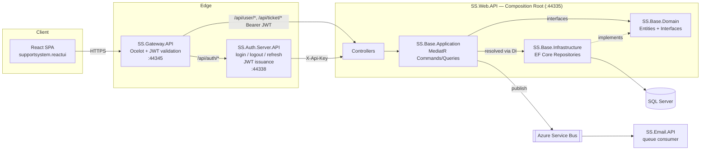
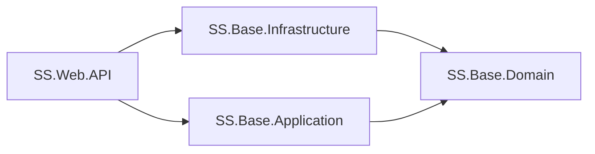

# Support System — Architecture

This system follows **Clean Architecture** for its core business logic (users, tickets), fronted by a set of thin ASP.NET Core edge services and a React SPA. The goal of the layering is: business rules (Domain) know nothing about the database, the web, or any framework; everything else depends inward on them.

## Solution map

| Project | Layer | Depends on | Purpose |
|---|---|---|---|
| `SS.Base.Domain` | **Domain** | *(nothing)* | Entities, repository interfaces, DTOs. The center of the system. |
| `SS.Base.Application` | **Application** | `SS.Base.Domain` | Use cases: MediatR commands/queries + handlers (CQRS). Orchestrates domain objects via repository interfaces it doesn't implement. |
| `SS.Base.Infrastructure` | **Infrastructure** | `SS.Base.Domain` | EF Core `DbContext`, repository implementations, `IUnitOfWork`, migrations. Implements the interfaces Domain declares. |
| `SS.Web.API` | **Presentation** (composition root) | `SS.Base.Application`, `SS.Base.Infrastructure` | The only host that wires Domain + Application + Infrastructure together. Owns `UserController`/`TicketController`, protected by an internal `X-Api-Key` header rather than JWT. |
| `SS.Auth.Server.API` | Edge service | *(none — HTTP client only)* | Issues/validates JWTs, mints refresh tokens. Talks to `SS.Web.API` over HTTP as a plain client, not via project references. |
| `SS.Gateway.API` | Edge service | *(none — Ocelot only)* | Ocelot reverse proxy (`ocelot.json`). Single entry point for the frontend; validates JWT bearer tokens on protected routes before forwarding to `SS.Web.API`. |
| `SS.Email.API` | Edge service | *(none)* | Standalone worker that drains an Azure Service Bus queue and sends emails (e.g. "user created"). Decoupled from the rest of the system by messaging, not by reference. |
| `supportsystem.reactui` | Client | *(HTTP only)* | React 18 + Redux Toolkit SPA. Talks only to the Gateway. |

## The dependency rule

`SS.Base.Domain` has zero project references — it's pure C# (entities, `Role`/`TicketStatus`/`TicketVisibility` enums, `I*Repository` interfaces, `IUnitOfWork`). Both `SS.Base.Application` and `SS.Base.Infrastructure` reference *only* `SS.Base.Domain`, never each other. `SS.Web.API` is the single place both are wired together (`ApplicationStartup.AddApplicationServices` + `Infrastructure.DependencyInjection.AddInfrastructureServices`, called from `Program.cs`), which is what makes it the composition root.

## Layer details

### Domain — `SS.Base.Domain`
- `Entities/`: `User`, `UserProfile`, `Ticket`, `TicketUpdate`, `TicketLog`, `RefreshToken`, `Permission`/`RolePermission`/`UserPermission`, plus enums (`Role`, `TicketStatus`, `TicketVisibility`).
- `Interfaces/Repository/`: `IGenericRepository<T>`, `IUserRepository`, `ITicketRepository`, `ITicketUpdateRepository`, `IRefreshTokenRepository`, `IUnitOfWork` — the ports that Application codes against and Infrastructure implements.
- `Dto/`, `Email/`: transport-shape objects (e.g. `UserCreatedMessage` sent over the service bus).

### Application — `SS.Base.Application`
CQRS via MediatR: one folder per use case under `Commands/<Aggregate>/<UseCase>/` and `Queries/<Aggregate>/<UseCase>/`, each with a `*Command`/`*Query` (the `IRequest`) and a `*Handler` (the `IRequestHandler`).

- User: `CreateUser`, `ValidateUser`, `LoginSuccess` (persists a new `RefreshToken` on login), `LogOut` (revokes a `RefreshToken`), `TokenRefresh` (validates + rotates a `RefreshToken`), `GetUserByEmail`, `UpdateUserRole`.
- Ticket: `CreateTicket`, `AddTicketUpdate`, `ModifyTicketUpdate`, `UpdateTicketStatus`, `GetTicketById`.
- `Events/AzureServiceBusQueueSender.cs`: Application publishes domain events (e.g. user-created) onto a queue rather than calling `SS.Email.API` directly — that's how the email service stays decoupled.
- `ApplicationStartup.cs`: DI extension (`AddApplicationServices`) — registers MediatR handlers scanned from this assembly, `IPasswordHasher<User>`, and the queue sender. This is the only place Application registers itself; it takes no dependency on Infrastructure.

Handlers depend only on the Domain repository interfaces (e.g. `TokenRefreshHandler` takes `IRefreshTokenRepository`, `IUserRepository`, `IUnitOfWork` in its constructor) — never on `SS.Base.Infrastructure` types directly.

### Infrastructure — `SS.Base.Infrastructure`
- `Persistance/MSSQL/MSSQLDbContext.cs`: EF Core context.
- `Persistance/MSSQL/Repositories/`: `UserRepository`, `TicketRepository`, `TicketUpdateRepository`, `RefreshTokenRepository`, `UnitOfWork` — implement the Domain interfaces against EF Core.
- `Migrations/`: EF Core migration history (SQL Server).
- `DependencyInjection.cs`: DI extension (`AddInfrastructureServices`) — registers the `DbContext` (SQL Server, connection string from config) and every repository/`IUnitOfWork` implementation.

### Presentation / composition root — `SS.Web.API`
- `Controllers/UserController.cs`, `TicketController.cs` (thin — deserialize request, `_mediator.Send(...)`, return the result).
- `Middlewares/ApiKeyMiddleware.cs`: gates a handful of routes (`validate`, `saverefreshtoken`, `logout`) behind a shared `X-Api-Key` header, since this API is only ever called server-to-server (by the Auth Server or the Gateway), never directly by the browser.
- `Program.cs` calls `AddApplicationServices` + `AddInfrastructureServices` — the only place in the solution where Application and Infrastructure are both referenced and wired together.

### Edge services (outside the Clean Architecture core)
These are intentionally **not** part of the layered core — they have no project references to Domain/Application/Infrastructure and talk to `SS.Web.API` purely over HTTP, so they can be deployed, scaled, and reasoned about independently:

- **`SS.Auth.Server.API`**: owns the JWT secret and `GenerateJwtToken`. `login`/`logout`/`refresh-token` all proxy to `SS.Web.API` (with an `X-Api-Key` header) for the actual data operation, then mint/return the token.
- **`SS.Gateway.API`**: Ocelot-based reverse proxy (`ocelot.json`). Single public entry point (`:44345`) for the SPA. Validates the JWT bearer token (same symmetric key as the Auth Server) on `/api/user/*` and `/api/ticket/*` routes before forwarding; `/api/auth/*` routes are unauthenticated (that's precisely where a client with an expired/no token needs to reach).
- **`SS.Email.API`**: standalone Azure Service Bus consumer + SMTP sender. Reacts to events published by `SS.Base.Application` (e.g. `UserCreatedMessage`) — a messaging seam, not a Clean Architecture layer.

### Client — `supportsystem.reactui`
React 18 + Redux Toolkit, talking only to the Gateway (`https://localhost:44345/api`):
- `src/features/authSlice.js`: auth state + thunks (`loginUser`, `logoutUser`, `refreshAccessToken`, `fetchUser`).
- `src/api/axios.js`: shared axios instance — attaches the bearer token on every request and transparently refreshes it on a 401 before retrying.
- `src/components/`, `src/pages/`: screens (ticket list/create/detail, user list/create).
- `src/app/store.js`: Redux store.

## Request flow examples

**Login:**
`SPA → Gateway (/api/auth/login, no auth) → Auth Server → Web API (/api/user/validate, X-Api-Key) → ValidateUserHandler → UserRepository → SQL Server`. On success the Auth Server calls `SS.Web.API`'s `saverefreshtoken` (→ `LoginSuccessHandler`, persists a `RefreshToken`), mints a JWT, and returns `{ token, refreshToken }` to the SPA.

**Authenticated read/write (e.g. create ticket):**
`SPA (Bearer JWT) → Gateway (validates JWT) → Web API → TicketController → CreateTicketCommand → CreateTicketHandler → ITicketRepository → SQL Server`.

**Token refresh:**
`SPA → Gateway (/api/auth/refresh-token, no auth — token may be expired) → Auth Server → Web API (/api/user/refresh-token, X-Api-Key) → TokenRefreshHandler` validates and rotates the `RefreshToken` via `IRefreshTokenRepository`/`IUnitOfWork`, returns the user's email/role → Auth Server mints a new JWT → SPA's axios interceptor retries the original request.

## Known gaps / technical debt

- The JWT signing key is hardcoded (duplicated) in both `SS.Auth.Server.API/Controllers/AuthController.cs` and `SS.Gateway.API/Program.cs` instead of coming from configuration/secret storage.
- `SS.Web.API`'s inter-service auth (`X-Api-Key`) is a single shared string in code, not a rotated secret.
- No `Application`-layer input validation pipeline (e.g. FluentValidation + MediatR behavior) yet — the `Validators/` folder exists but is empty.
- `SS.Gateway.API/ocelot.json` still has leftover routes pointing at `localhost:3000` (`/`, `/static/{everything}`, `/user/{everything}`, `/ticket/{everything}`) that predate the current API-only gateway usage.
