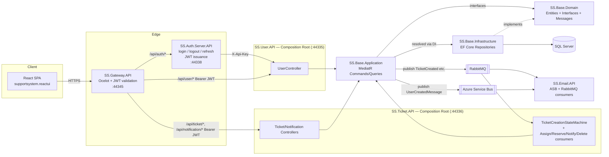
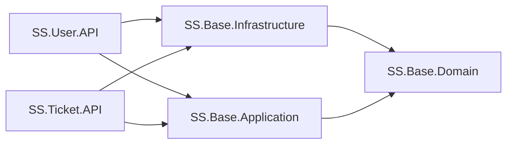

# Support System — Architecture

This system follows **Clean Architecture** for its core business logic (users, tickets), fronted by a set of thin ASP.NET Core edge services and a React SPA. The goal of the layering is: business rules (Domain) know nothing about the database, the web, or any framework; everything else depends inward on them.

## Solution map

| Project | Layer | Depends on | Purpose |
|---|---|---|---|
| `SS.Base.Domain` | **Domain** | *(nothing but MassTransit's abstractions — see note below)* | Entities, repository interfaces, DTOs, cross-service message contracts. The center of the system. |
| `SS.Base.Application` | **Application** | `SS.Base.Domain` | Use cases: MediatR commands/queries + handlers (CQRS), plus the ticket-creation saga state machine and its MassTransit consumers. Orchestrates domain objects via repository interfaces it doesn't implement. |
| `SS.Base.Infrastructure` | **Infrastructure** | `SS.Base.Domain` | EF Core `DbContext`, repository implementations, `IUnitOfWork`, migrations. Implements the interfaces Domain declares, including saga-state persistence. |
| `SS.User.API` | **Presentation** (composition root) | `SS.Base.Application`, `SS.Base.Infrastructure` | Owns `UserController`, protected internally by an `X-Api-Key` header rather than JWT. |
| `SS.Ticket.API` | **Presentation** (composition root) | `SS.Base.Application`, `SS.Base.Infrastructure` | Owns `TicketController`/`TicketUpdateController`/`NotificationController`, plus the RabbitMQ/MassTransit wiring for the ticket-creation saga (see below). |
| `SS.Auth.Server.API` | Edge service | *(none — HTTP client only)* | Issues/validates JWTs, mints refresh tokens. Talks to `SS.User.API` over HTTP as a plain client, not via project references. |
| `SS.Gateway.API` | Edge service | *(none — Ocelot only)* | Ocelot reverse proxy (`ocelot.json`). Single entry point for the frontend; validates JWT bearer tokens on protected routes before forwarding to `SS.User.API`/`SS.Ticket.API`. |
| `SS.Email.API` | Edge service | *(none)* | Standalone worker that drains an Azure Service Bus queue (user-created emails) **and** consumes RabbitMQ messages from the ticket-creation saga (ticket-received / ticket-creation-failed emails). Decoupled from the rest of the system by messaging, not by reference. |
| `supportsystem.reactui` | Client | *(HTTP only)* | React 18 + Redux Toolkit SPA. Talks only to the Gateway. |

> `SS.Base.Domain` referencing `MassTransit.Abstractions` is a deliberate, narrow exception to "zero dependencies": MassTransit's saga state machine requires the persisted saga-state class to implement its `SagaStateMachineInstance` marker interface, and that class needs to live somewhere Infrastructure can map it without Infrastructure depending on Application — Domain is the natural home, same as any other persisted entity.

## The dependency rule

`SS.Base.Domain` has no project references onto Application or Infrastructure — it's pure C# (entities, `Role`/`TicketStatus`/`TicketVisibility` enums, `I*Repository` interfaces, `IUnitOfWork`, message contracts). Both `SS.Base.Application` and `SS.Base.Infrastructure` reference *only* `SS.Base.Domain`, never each other. `SS.User.API` and `SS.Ticket.API` are each a composition root wiring both together (`ApplicationStartup.AddApplicationServices` + `Infrastructure.DependencyInjection.AddInfrastructureServices`, called from their respective `Program.cs`) — there are now two composition roots instead of one, since Users and Tickets are split into separate deployable services. They still share one SQL Server database/schema and one `MSSQLDbContext`/migration history — this is a host-process split, not a database-per-service split.

## Layer details

### Domain — `SS.Base.Domain`
- `Entities/`: `User`, `UserProfile`, `Ticket`, `TicketUpdate`, `TicketLog`, `RefreshToken`, `Notification`, `RoundRobinCursor`, `TicketCreationSagaState`, `Permission`/`RolePermission`/`UserPermission`, plus enums (`Role`, `TicketStatus`, `TicketVisibility`).
- `Interfaces/Repository/`: `IGenericRepository<T>` (now including `RemoveAsync`), `IUserRepository` (including `GetNextAgentForAssignmentAsync`, the round-robin engineer picker), `ITicketRepository`, `ITicketUpdateRepository`, `IRefreshTokenRepository`, `INotificationRepository`, `IUnitOfWork` — the ports Application codes against and Infrastructure implements.
- `Messages/Ticket/`: the ticket-creation saga's cross-service contracts — `TicketCreated`, `AssignEngineerCommand`/`EngineerAssigned`/`AssignEngineerFailed`, `ReserveSlaCommand`/`SlaReserved`, `DeleteTicketCommand` (compensation), `SendTicketCreationFailedEmail` (compensation). Referenced by both `SS.Ticket.API` (via Application) and `SS.Email.API` (direct reference, same as `UserCreatedMessage`).
- `Dto/`, `Email/`: transport-shape objects (e.g. `UserCreatedMessage` sent over the service bus).

### Application — `SS.Base.Application`
CQRS via MediatR: one folder per use case under `Commands/<Aggregate>/<UseCase>/` and `Queries/<Aggregate>/<UseCase>/`, each with a `*Command`/`*Query` (the `IRequest`) and a `*Handler` (the `IRequestHandler`).

- User: `CreateUser`, `ValidateUser`, `LoginSuccess` (persists a new `RefreshToken` on login), `LogOut` (revokes a `RefreshToken`), `TokenRefresh` (validates + rotates a `RefreshToken`), `GetUserByEmail`, `UpdateUserRole`.
- Ticket: `CreateTicket` (now publishes `TicketCreated` via `IPublishEndpoint` after saving, starting the saga below), `AddTicketUpdate`, `ModifyTicketUpdate`, `UpdateTicketStatus`, `GetTicketById`.
- Notification: `GetNotificationsByUser`.
- `Events/AzureServiceBusQueueSender.cs`: publishes domain events (e.g. user-created) onto Azure Service Bus rather than calling `SS.Email.API` directly.
- `Sagas/TicketCreationStateMachine.cs`: a `MassTransitStateMachine<TicketCreationSagaState>` orchestrating ticket creation — see [Ticket-creation saga](#ticket-creation-saga) below.
- `Consumers/`: `AssignEngineerConsumer`, `ReserveSlaConsumer`, `CreateNotificationConsumer`, `DeleteTicketConsumer` — plain MassTransit `IConsumer<T>` classes that take repositories via DI, same constructor-injection style as the command Handlers.
- `ApplicationStartup.cs`: DI extension (`AddApplicationServices`) — registers MediatR handlers scanned from this assembly, `IPasswordHasher<User>`, and the queue sender. This is the only place Application registers itself; it takes no dependency on Infrastructure. (The saga/consumers themselves are registered by whichever host calls `AddMassTransit` — currently only `SS.Ticket.API`.)

Handlers and consumers depend only on the Domain repository interfaces (e.g. `TokenRefreshHandler` takes `IRefreshTokenRepository`, `IUserRepository`, `IUnitOfWork`; `AssignEngineerConsumer` takes `ITicketRepository`, `IUserRepository`, `IUnitOfWork`) — never on `SS.Base.Infrastructure` types directly.

### Infrastructure — `SS.Base.Infrastructure`
- `Persistance/MSSQL/MSSQLDbContext.cs`: EF Core context, including the `TicketCreationSagaState` mapping MassTransit's EF Core saga repository persists against.
- `Persistance/MSSQL/Repositories/`: `UserRepository`, `TicketRepository`, `TicketUpdateRepository`, `RefreshTokenRepository`, `NotificationRepository`, `UnitOfWork` — implement the Domain interfaces against EF Core.
- `Migrations/`: EF Core migration history (SQL Server).
- `DependencyInjection.cs`: DI extension (`AddInfrastructureServices`) — registers the `DbContext` (SQL Server, connection string from config) and every repository/`IUnitOfWork` implementation.

### Presentation / composition roots — `SS.User.API` and `SS.Ticket.API`
- `SS.User.API/Controllers/UserController.cs` (thin — deserialize request, `_mediator.Send(...)`, return the result). `Middlewares/ApiKeyMiddleware.cs` gates `validate`/`saverefreshtoken`/`logout` behind a shared `X-Api-Key` header, since this API is only ever called server-to-server (by the Auth Server or the Gateway), never directly by the browser.
- `SS.Ticket.API/Controllers/TicketController.cs`, `TicketUpdateController.cs`, `NotificationController.cs` — same thin-controller style. `Program.cs` additionally calls `AddMassTransit(...)` to register the saga (EF Core-persisted) and its consumers, and connects to RabbitMQ using the `RabbitMq` section of `appsettings.json`.
- Both call `AddApplicationServices` + `AddInfrastructureServices` — each is a place in the solution where Application and Infrastructure are both referenced and wired together.

### Edge services (outside the Clean Architecture core)
These are intentionally **not** part of the layered core — they have no project references to Domain/Application/Infrastructure and talk to `SS.User.API`/`SS.Ticket.API` purely over HTTP or messaging, so they can be deployed, scaled, and reasoned about independently:

- **`SS.Auth.Server.API`**: owns the JWT secret and `GenerateJwtToken`. `login`/`logout`/`refresh-token` all proxy to `SS.User.API` (with an `X-Api-Key` header) for the actual data operation, then mint/return the token.
- **`SS.Gateway.API`**: Ocelot-based reverse proxy (`ocelot.json`). Single public entry point (`:44345`) for the SPA. Validates the JWT bearer token (same symmetric key as the Auth Server) on `/api/user/*`, `/api/ticket/*`, `/api/ticketupdate/*` and `/api/notification/*` routes before forwarding to `:44335` (User) or `:44336` (Ticket); `/api/auth/*` routes are unauthenticated (that's precisely where a client with an expired/no token needs to reach).
- **`SS.Email.API`**: Azure Service Bus consumer (user-created emails, existing) **and** RabbitMQ consumer (`TicketCreatedEmailConsumer`, `TicketCreationFailedEmailConsumer` — ticket-creation saga emails, new). Reacts to events published by `SS.Base.Application` — a messaging seam, not a Clean Architecture layer.

### Client — `supportsystem.reactui`
React 18 + Redux Toolkit, talking only to the Gateway (`https://localhost:44345/api`):
- `src/features/authSlice.js`: auth state + thunks (`loginUser`, `logoutUser`, `refreshAccessToken`, `fetchUser`).
- `src/api/axios.js`: shared axios instance — attaches the bearer token on every request and transparently refreshes it on a 401 before retrying.
- `src/components/`, `src/pages/`: screens (ticket list/create/detail, user list/create). `TicketCreateForm.js` no longer sends `AssignedTo` — engineer assignment is now server/saga-driven.
- `src/app/store.js`: Redux store.

## Request flow examples

**Login:**
`SPA → Gateway (/api/auth/login, no auth) → Auth Server → User API (/api/user/validate, X-Api-Key) → ValidateUserHandler → UserRepository → SQL Server`. On success the Auth Server calls `SS.User.API`'s `saverefreshtoken` (→ `LoginSuccessHandler`, persists a `RefreshToken`), mints a JWT, and returns `{ token, refreshToken }` to the SPA.

**Token refresh:**
`SPA → Gateway (/api/auth/refresh-token, no auth — token may be expired) → Auth Server → User API (/api/user/refresh-token, X-Api-Key) → TokenRefreshHandler` validates and rotates the `RefreshToken` via `IRefreshTokenRepository`/`IUnitOfWork`, returns the user's email/role → Auth Server mints a new JWT → SPA's axios interceptor retries the original request.

### Ticket-creation saga

`SPA (Bearer JWT) → Gateway → Ticket API → TicketController → CreateTicketCommand → CreateTicketHandler` persists the `Ticket` (unassigned — `AssignedTo`/`ResponseDueDate`/`ResolutionDueDate` are all nullable until the saga fills them in) and publishes `TicketCreated` to RabbitMQ. Three things react to it independently:

1. **`TicketCreationStateMachine`** (in `SS.Ticket.API`) starts, transitions to `AssigningEngineer`, and publishes `AssignEngineerCommand`.
   - `AssignEngineerConsumer` round-robins over `Role.Agent` users (`IUserRepository.GetNextAgentForAssignmentAsync`, cursor persisted in `RoundRobinCursor`). No agents available → publishes `AssignEngineerFailed`; otherwise sets `Ticket.AssignedTo` and publishes `EngineerAssigned`.
   - On `EngineerAssigned`, the saga transitions to `ReservingSla` and publishes `ReserveSlaCommand`. `ReserveSlaConsumer` applies a priority-based SLA policy (High: 4h response/1d resolution, Medium: 1d/3d, Low: 2d/7d), sets `Ticket.Status = InProgress` ("Ticket Ready"), and publishes `SlaReserved` — the saga finalizes.
   - On `AssignEngineerFailed` (compensation path): the saga publishes `DeleteTicketCommand` (→ `DeleteTicketConsumer` removes the ticket) and `SendTicketCreationFailedEmail`, then finalizes as failed. Only this explicit "no agents available" business failure triggers compensation — infrastructure-level consumer faults fall back to MassTransit's default retry/error-queue behavior.
2. **`CreateNotificationConsumer`** (in `SS.Ticket.API`) reacts to `TicketCreated` directly, writing a `Notification` row for the ticket's creator — not gated by the saga.
3. **`TicketCreatedEmailConsumer`** (in `SS.Email.API`) reacts to `TicketCreated` directly, emailing the creator a "ticket received" message.

RabbitMQ's default convention-based topology means all three subscribers receive their own copy of `TicketCreated` with no manual exchange/queue configuration.

## Known gaps / technical debt

- The JWT signing key is hardcoded (duplicated) in both `SS.Auth.Server.API/Controllers/AuthController.cs` and `SS.Gateway.API/Program.cs` instead of coming from configuration/secret storage.
- `SS.User.API`'s inter-service auth (`X-Api-Key`) is a single shared string in code, not a rotated secret.
- No `Application`-layer input validation pipeline (e.g. FluentValidation + MediatR behavior) yet — the `Validators/` folder exists but is empty.
- `SS.Gateway.API/ocelot.json` still has leftover routes pointing at `localhost:3000` (`/`, `/static/{everything}`, `/user/{everything}`, `/ticket/{everything}`) that predate the current API-only gateway usage.
- RabbitMQ has no auth/TLS hardening for local dev (`guest`/`guest`, matching the broker's own defaults) — fine for `docker-compose.rabbitmq.yml` locally, not production-ready as-is.
