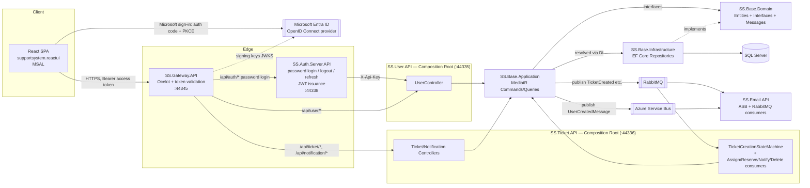
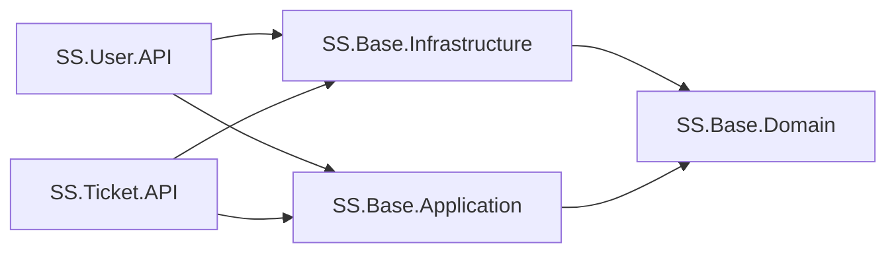

# Support System — Architecture

This system follows **Clean Architecture** for its core business logic (users, tickets), fronted by a set of thin ASP.NET Core edge services and a React SPA. The goal of the layering is: business rules (Domain) know nothing about the database, the web, or any framework; everything else depends inward on them.

## Solution map

| Project | Layer | Depends on | Purpose |
|---|---|---|---|
| `SS.Base.Domain` | **Domain** | *(nothing but MassTransit's abstractions — see note below)* | Entities, repository interfaces, DTOs, cross-service message contracts. The center of the system. |
| `SS.Base.Application` | **Application** | `SS.Base.Domain` | Use cases: MediatR commands/queries + handlers (CQRS), plus the ticket-creation saga state machine and its MassTransit consumers. Orchestrates domain objects via repository interfaces it doesn't implement. |
| `SS.Base.Infrastructure` | **Infrastructure** | `SS.Base.Domain` | EF Core `DbContext`, repository implementations, `IUnitOfWork`, migrations. Implements the interfaces Domain declares, including saga-state persistence. |
| `SS.User.API` | **Presentation** (composition root) | `SS.Base.Application`, `SS.Base.Infrastructure` | Owns `UserController`. `/api/user/me` validates the caller's access token itself (either sign-in option); the endpoints the Auth Server calls are protected by an `X-Api-Key` header. |
| `SS.Ticket.API` | **Presentation** (composition root) | `SS.Base.Application`, `SS.Base.Infrastructure` | Owns `TicketController`/`TicketUpdateController`/`NotificationController`, plus the RabbitMQ/MassTransit wiring for the ticket-creation saga (see below). |
| `SS.Auth.Server.API` | Edge service | *(none — HTTP client only)* | Email/password sign-in (one of the two options, see [Authentication](#authentication)): issues HS256 JWTs, mints refresh tokens. Talks to `SS.User.API` over HTTP as a plain client, not via project references. |
| `SS.Gateway.API` | Edge service | *(none — Ocelot only)* | Ocelot reverse proxy (`ocelot.json`). Single entry point for the frontend; validates bearer tokens from either sign-in option (Auth Server JWT or Microsoft Entra ID) on protected routes before forwarding to `SS.User.API`/`SS.Ticket.API`. |
| `SS.Base.Authentication` | Cross-cutting | *(none — ASP.NET Core JwtBearer only)* | Shared bearer-token setup (`AddSupportSystemAuthentication`) used by the Gateway and User API: accepts either sign-in option's tokens — see [Authentication](#authentication). |
| `SS.Email.API` | Edge service | *(none)* | Standalone worker that drains an Azure Service Bus queue (user-created emails) **and** consumes RabbitMQ messages from the ticket-creation saga (ticket-received / ticket-creation-failed emails). Decoupled from the rest of the system by messaging, not by reference. |
| `SS.Base.Observability` | Cross-cutting | *(none — ASP.NET Core + OpenTelemetry only)* | Shared logging/tracing/metrics setup (`AddSupportSystemObservability`) referenced by every .NET host — see [Observability](#observability). Knows nothing about the business layers. |
| `supportsystem.reactui` | Client | *(HTTP only)* | React 18 + Redux Toolkit SPA. Signs users in with email/password or Microsoft Entra ID (MSAL, authorization code + PKCE); calls only the Gateway. |

> `SS.Base.Domain` referencing `MassTransit.Abstractions` is a deliberate, narrow exception to "zero dependencies": MassTransit's saga state machine requires the persisted saga-state class to implement its `SagaStateMachineInstance` marker interface, and that class needs to live somewhere Infrastructure can map it without Infrastructure depending on Application — Domain is the natural home, same as any other persisted entity.


```mermaid
flowchart LR
    subgraph Client
        UI[React SPA<br/>supportsystem.reactui<br/>MSAL]
    end

    ENTRA[[Microsoft Entra ID<br/>OpenID Connect provider]]

    subgraph Edge
        GW[SS.Gateway.API<br/>Ocelot + token validation<br/>:44345]
        AUTH[SS.Auth.Server.API<br/>password login / logout / refresh<br/>JWT issuance<br/>:44338]
    end

    subgraph UserCore["SS.User.API — Composition Root (:44335)"]
        UAPI[UserController]
    end

    subgraph TicketCore["SS.Ticket.API — Composition Root (:44336)"]
        TAPI[Ticket/Notification Controllers]
        SAGA[TicketCreationStateMachine<br/>+ Assign/Reserve/Notify/Delete consumers]
    end

    APP[SS.Base.Application<br/>MediatR Commands/Queries]
    DOM[SS.Base.Domain<br/>Entities + Interfaces + Messages]
    INFRA[SS.Base.Infrastructure<br/>EF Core Repositories]

    DB[(SQL Server)]
    ASB[[Azure Service Bus]]
    MQ[[RabbitMQ]]
    EMAIL[SS.Email.API<br/>ASB + RabbitMQ consumers]

    UI -->|Microsoft sign-in: auth code + PKCE| ENTRA
    UI -->|HTTPS, Bearer access token| GW
    GW -.signing keys JWKS.-> ENTRA
    GW -->|/api/auth/* password login| AUTH
    GW -->|/api/user/*| UAPI
    GW -->|/api/ticket/*, /api/notification/*| TAPI
    AUTH -->|X-Api-Key| UAPI
    UAPI --> APP
    TAPI --> APP
    SAGA --> APP
    APP -->|interfaces| DOM
    INFRA -.implements.-> DOM
    APP -->|resolved via DI| INFRA
    INFRA --> DB
    APP -->|publish TicketCreated etc.| MQ
    MQ --> SAGA
    MQ --> EMAIL
    APP -->|publish UserCreatedMessage| ASB
    ASB --> EMAIL
```

## The dependency rule


```mermaid
flowchart LR
    Infra[SS.Base.Infrastructure] --> Domain[SS.Base.Domain]
    App[SS.Base.Application] --> Domain
    UserAPI[SS.User.API] --> App
    UserAPI --> Infra
    TicketAPI[SS.Ticket.API] --> App
    TicketAPI --> Infra
```

`SS.Base.Domain` has no project references onto Application or Infrastructure — it's pure C# (entities, `Role`/`TicketStatus`/`TicketVisibility` enums, `I*Repository` interfaces, `IUnitOfWork`, message contracts). Both `SS.Base.Application` and `SS.Base.Infrastructure` reference *only* `SS.Base.Domain`, never each other. `SS.User.API` and `SS.Ticket.API` are each a composition root wiring both together (`ApplicationStartup.AddApplicationServices` + `Infrastructure.DependencyInjection.AddInfrastructureServices`, called from their respective `Program.cs`) — there are now two composition roots instead of one, since Users and Tickets are split into separate deployable services. They still share one SQL Server database/schema and one `MSSQLDbContext`/migration history — this is a host-process split, not a database-per-service split.

## Layer details

### Domain — `SS.Base.Domain`
- `Entities/`: `User`, `UserProfile`, `Ticket`, `TicketUpdate`, `TicketLog`, `RefreshToken`, `Notification`, `RoundRobinCursor`, `TicketCreationSagaState`, `Permission`/`RolePermission`/`UserPermission`, plus enums (`Role`, `TicketStatus`, `TicketVisibility`).
- `Interfaces/Repository/`: `IGenericRepository<T>` (now including `RemoveAsync`), `IUserRepository` (including `GetNextAgentForAssignmentAsync`, the round-robin engineer picker), `ITicketRepository`, `ITicketUpdateRepository`, `IRefreshTokenRepository`, `INotificationRepository`, `IUnitOfWork` — the ports Application codes against and Infrastructure implements.
- `Messages/Ticket/`: the ticket-creation saga's cross-service contracts — `TicketCreated`, `AssignEngineerCommand`/`EngineerAssigned`/`AssignEngineerFailed`, `ReserveSlaCommand`/`SlaReserved`, `DeleteTicketCommand` (compensation), `SendTicketCreationFailedEmail` (compensation). Referenced by both `SS.Ticket.API` (via Application) and `SS.Email.API` (direct reference, same as `UserCreatedMessage`).
- `Dto/`, `Email/`: transport-shape objects (e.g. `UserCreatedMessage` sent over the service bus).

### Application — `SS.Base.Application`
CQRS via MediatR: one folder per use case under `Commands/<Aggregate>/<UseCase>/` and `Queries/<Aggregate>/<UseCase>/`, each with a `*Command`/`*Query` (the `IRequest`) and a `*Handler` (the `IRequestHandler`).

- User: `CreateUser`, `ValidateUser`, `LoginSuccess` (persists a new `RefreshToken` on login), `LogOut` (revokes a `RefreshToken`), `TokenRefresh` (validates + rotates a `RefreshToken`), `GetUserByEmail`, `UpdateUserRole`.
- Ticket: `CreateTicket` (now publishes `TicketCreated` via `IPublishEndpoint` after saving, starting the saga below), `AddTicketUpdate`, `ModifyTicketUpdate`, `UpdateTicketStatus`, `GetTicketById`.
- Notification: `GetNotificationsByUser`.
- `Events/AzureServiceBusQueueSender.cs`: publishes domain events (e.g. user-created) onto Azure Service Bus rather than calling `SS.Email.API` directly.
- `Sagas/TicketCreationStateMachine.cs`: a `MassTransitStateMachine<TicketCreationSagaState>` orchestrating ticket creation — see [Ticket-creation saga](#ticket-creation-saga) below.
- `Consumers/`: `AssignEngineerConsumer`, `ReserveSlaConsumer`, `CreateNotificationConsumer`, `DeleteTicketConsumer` — plain MassTransit `IConsumer<T>` classes that take repositories via DI, same constructor-injection style as the command Handlers.
- `ApplicationStartup.cs`: DI extension (`AddApplicationServices`) — registers MediatR handlers scanned from this assembly, `IPasswordHasher<User>`, and the queue sender. This is the only place Application registers itself; it takes no dependency on Infrastructure. (The saga/consumers themselves are registered by whichever host calls `AddMassTransit` — currently only `SS.Ticket.API`.)

Handlers and consumers depend only on the Domain repository interfaces (e.g. `TokenRefreshHandler` takes `IRefreshTokenRepository`, `IUserRepository`, `IUnitOfWork`; `AssignEngineerConsumer` takes `ITicketRepository`, `IUserRepository`, `IUnitOfWork`) — never on `SS.Base.Infrastructure` types directly.

### Infrastructure — `SS.Base.Infrastructure`
- `Persistance/MSSQL/MSSQLDbContext.cs`: EF Core context, including the `TicketCreationSagaState` mapping MassTransit's EF Core saga repository persists against.
- `Persistance/MSSQL/Repositories/`: `UserRepository`, `TicketRepository`, `TicketUpdateRepository`, `RefreshTokenRepository`, `NotificationRepository`, `UnitOfWork` — implement the Domain interfaces against EF Core.
- `Migrations/`: EF Core migration history (SQL Server).
- `DependencyInjection.cs`: DI extension (`AddInfrastructureServices`) — registers the `DbContext` (SQL Server, connection string from config) and every repository/`IUnitOfWork` implementation.

### Presentation / composition roots — `SS.User.API` and `SS.Ticket.API`
- `SS.User.API/Controllers/UserController.cs` (thin — deserialize request, `_mediator.Send(...)`, return the result). `Middlewares/ApiKeyMiddleware.cs` gates `validate`/`saverefreshtoken`/`logout` behind a shared `X-Api-Key` header, since this API is only ever called server-to-server (by the Auth Server or the Gateway), never directly by the browser.
- `SS.Ticket.API/Controllers/TicketController.cs`, `TicketUpdateController.cs`, `NotificationController.cs` — same thin-controller style. `Program.cs` additionally calls `AddMassTransit(...)` to register the saga (EF Core-persisted) and its consumers, and connects to RabbitMQ using the `RabbitMq` section of `appsettings.json`.
- Both call `AddApplicationServices` + `AddInfrastructureServices` — each is a place in the solution where Application and Infrastructure are both referenced and wired together.

### Edge services (outside the Clean Architecture core)
These are intentionally **not** part of the layered core — they have no project references to Domain/Application/Infrastructure and talk to `SS.User.API`/`SS.Ticket.API` purely over HTTP or messaging, so they can be deployed, scaled, and reasoned about independently:

- **`SS.Auth.Server.API`**: the email/password sign-in option. Signs JWTs with `Jwt:SigningKey` (`GenerateJwtToken`). `login`/`logout`/`refresh-token` all proxy to `SS.User.API` (with an `X-Api-Key` header) for the actual data operation, then mint/return the token.
- **`SS.Gateway.API`**: Ocelot-based reverse proxy (`ocelot.json`). Single public entry point (`:44345`) for the SPA. Validates the bearer token — an Auth Server JWT (`Jwt:SigningKey`) or a Microsoft Entra ID access token (tenant's published keys, issuer, audience) — on `/api/user/*`, `/api/ticket/*`, `/api/ticketupdate/*` and `/api/notification/*` before forwarding to `:44335` (User) or `:44336` (Ticket); `/api/auth/*` routes are unauthenticated (that's where a client with an expired/no token needs to reach). See [Authentication](#authentication).
- **`SS.Email.API`**: Azure Service Bus consumer (user-created emails, existing) **and** RabbitMQ consumer (`TicketCreatedEmailConsumer`, `TicketCreationFailedEmailConsumer` — ticket-creation saga emails, new). Reacts to events published by `SS.Base.Application` — a messaging seam, not a Clean Architecture layer.

### Client — `supportsystem.reactui`
React 18 + Redux Toolkit, talking only to the Gateway (`https://localhost:44345/api`):
- `src/auth/passwordAuth.js`: email/password sign-in through the Auth Server — access + refresh token in `localStorage`, single-flight refresh, logout.
- `src/auth/authConfig.js`: the MSAL `PublicClientApplication` (Microsoft Entra ID, authorization code + PKCE, token cache in `sessionStorage`), configured at runtime from `config.js`. The "Sign in with Microsoft" button is shown only when it is configured.
- `src/features/authSlice.js`: `loginUser` (password), `loginWithMicrosoft`, `logoutUser` (whichever session is active) and the signed-in user's Support System profile (`fetchUser` → `/api/user/me`).
- `src/api/axios.js`: shared axios instance — attaches the password-login token (refreshing it on a 401 before retrying) or else an Entra access token from MSAL (`acquireTokenSilent`, which renews it as needed).
- `src/components/`, `src/pages/`: screens (ticket list/create/detail, user list/create). `TicketCreateForm.js` no longer sends `AssignedTo` — engineer assignment is now server/saga-driven.
- `src/app/store.js`: Redux store.

## Request flow examples

**Login (email/password):**
`SPA → Gateway (/api/auth/login, no auth) → Auth Server → User API (/api/user/validate, X-Api-Key) → ValidateUserHandler → UserRepository → SQL Server`. On success the Auth Server calls `SS.User.API`'s `saverefreshtoken` (→ `LoginSuccessHandler`, persists a `RefreshToken`), mints a JWT, and returns `{ token, refreshToken }` to the SPA.

**Login (Microsoft Entra ID):**
`SPA "Sign in with Microsoft" → Microsoft Entra ID sign-in page → redirect back to the SPA with an authorization code → MSAL redeems it (with the PKCE verifier) for an ID token, access token and refresh token`.

Either way the SPA then calls `GET /api/user/me` (Gateway → User API), which reads the email claim from the validated token and returns the user's Support System `UserId`/`Role`/name. A signed-in account without a matching `Users` row gets a 403 and a "not registered" page.

**Token refresh (email/password):**
`SPA → Gateway (/api/auth/refresh-token, no auth — token may be expired) → Auth Server → User API (/api/user/refresh-token, X-Api-Key) → TokenRefreshHandler` validates and rotates the `RefreshToken` via `IRefreshTokenRepository`/`IUnitOfWork`, returns the user's email/role → Auth Server mints a new JWT → SPA's axios interceptor retries the original request.

**Token refresh (Microsoft Entra ID):**
Handled entirely by MSAL in the browser: `acquireTokenSilent` returns the cached access token or redeems the refresh token with Entra ID shortly before expiry. If Entra needs the user again (session ended, MFA, consent), it falls back to a sign-in redirect.

### Ticket-creation saga

`SPA (Bearer JWT) → Gateway → Ticket API → TicketController → CreateTicketCommand → CreateTicketHandler` persists the `Ticket` (unassigned — `AssignedTo`/`ResponseDueDate`/`ResolutionDueDate` are all nullable until the saga fills them in) and publishes `TicketCreated` to RabbitMQ. Three things react to it independently:

1. **`TicketCreationStateMachine`** (in `SS.Ticket.API`) starts, transitions to `AssigningEngineer`, and publishes `AssignEngineerCommand`.
   - `AssignEngineerConsumer` round-robins over `Role.Agent` users (`IUserRepository.GetNextAgentForAssignmentAsync`, cursor persisted in `RoundRobinCursor`). No agents available → publishes `AssignEngineerFailed`; otherwise sets `Ticket.AssignedTo` and publishes `EngineerAssigned`.
   - On `EngineerAssigned`, the saga transitions to `ReservingSla` and publishes `ReserveSlaCommand`. `ReserveSlaConsumer` applies a priority-based SLA policy (High: 4h response/1d resolution, Medium: 1d/3d, Low: 2d/7d), sets `Ticket.Status = InProgress` ("Ticket Ready"), and publishes `SlaReserved` — the saga finalizes.
   - On `AssignEngineerFailed` (compensation path): the saga publishes `DeleteTicketCommand` (→ `DeleteTicketConsumer` removes the ticket) and `SendTicketCreationFailedEmail`, then finalizes as failed. Only this explicit "no agents available" business failure triggers compensation — infrastructure-level consumer faults fall back to MassTransit's default retry/error-queue behavior.
2. **`CreateNotificationConsumer`** (in `SS.Ticket.API`) reacts to `TicketCreated` directly, writing a `Notification` row for the ticket's creator — not gated by the saga.
3. **`TicketCreatedEmailConsumer`** (in `SS.Email.API`) reacts to `TicketCreated` directly, emailing the creator a "ticket received" message.

RabbitMQ's default convention-based topology means all three subscribers receive their own copy of `TicketCreated` with no manual exchange/queue configuration.

## Authentication

There are two sign-in options, side by side on the login page:

1. **Email/password** — `SS.Auth.Server.API` checks the password against the `Users` table and issues an **HS256 JWT** (claims `email`, `UserId`, `role`; 1 h) plus a rotating refresh token. The signing key is `Jwt:SigningKey`.
2. **Microsoft Entra ID** — **OpenID Connect** sign-in with Entra ID as the identity provider and **OAuth 2.0** access tokens for the API. The SPA is a public client using the authorization code flow with **PKCE** (no client secret in the browser).

| Piece | Role | How |
|---|---|---|
| React SPA | OAuth *public client* | Password: `auth/passwordAuth.js`. Entra: `@azure/msal-browser`/`@azure/msal-react` get an **ID token** (who signed in — OpenID Connect) and an **access token** for the API scope (OAuth 2.0). |
| `SS.Base.Authentication` | shared validation | `AddSupportSystemAuthentication`: a `Bearer` policy scheme that looks at the token's issuer and forwards to one of two `JwtBearer` schemes — `EntraId` (`Authority = https://login.microsoftonline.com/<tenant>/v2.0`: OpenID metadata + signing keys; validates signature, issuer, audience, lifetime) or `SupportSystem` (Auth Server tokens: `Jwt:SigningKey`, lifetime). |
| `SS.Gateway.API` | OAuth *resource server* | Ocelot routes with `AuthenticationProviderKey: "Bearer"` reject requests without a valid token of either kind. |
| `SS.User.API` | resource server | Same validation, used by `[Authorize] GET /api/user/me` so the user's identity comes from the token, not from the request. |
| SQL `Users` table | authorization | Both options identify the user by email; the Support System `Role` (Admin/Agent/Customer) comes from the database. |

The Entra side needs no shared secret (only the tenant id and the API's client id, both public). The password side shares `Jwt:SigningKey` between the Auth Server, Gateway and User API: `appsettings.json` holds a development default, override it per environment with `Jwt__SigningKey` (k8s/Helm: `JWT_SIGNING_KEY` in the `supportsystem-secrets` Secret / `secrets.jwtSigningKey`). Leave the setting out rather than empty — an empty env var would override the default with `""`.

### One-time setup in the Azure portal (Microsoft Entra ID option)

Without these settings the app still runs with the email/password option only (no "Sign in with Microsoft" button).

1. **API app registration** — *Microsoft Entra ID → App registrations → New registration*, name `Support System API`, single tenant.
   - *Expose an API*: set the Application ID URI (`api://<api-client-id>`) and add a scope `access_as_user` (who can consent: Admins and users).
   - *Manifest*: set `"requestedAccessTokenVersion": 2`.
   - *Token configuration → Add optional claim → Access → `email`* (needed for guest accounts; members already have `preferred_username`).
2. **SPA app registration** — name `Support System SPA`, single tenant.
   - *Authentication → Add a platform → Single-page application*, redirect URIs (trailing slash included): `http://localhost:3000/` (`npm start`), `http://localhost/` (docker-compose), `https://<your-ingress-host>/` (AKS).
   - *API permissions → Add → My APIs → Support System API → `access_as_user`*, then *Grant admin consent* (optional; otherwise users consent on first sign-in).
3. **Users** — every person who signs in needs a `Users` row whose `PrimaryEmail` equals their Entra sign-in name / email. The role comes from that row.

### Configuration

| Where | Settings |
|---|---|
| Auth Server + Gateway + User API | `Jwt__SigningKey` (password-login tokens; same value in all three) |
| Gateway + User API (`appsettings.json` → `AzureAd`) | `AzureAd__TenantId`, `AzureAd__ClientId` (= API client id); optional `AzureAd__Audience` (defaults to `api://<ClientId>`) |
| React container (`config.js`, written by `40-app-config.sh`) | `ENTRA_TENANT_ID`, `ENTRA_SPA_CLIENT_ID`, `ENTRA_API_SCOPE` (`api://<api-client-id>/access_as_user`) |
| `npm start` | the same three as `REACT_APP_ENTRA_*` in `supportsystem.reactui/.env.local` |
| docker-compose | shell / `.env`: `ENTRA_TENANT_ID`, `ENTRA_API_CLIENT_ID`, `ENTRA_SPA_CLIENT_ID`, `ENTRA_API_SCOPE` |
| k8s / Helm | ConfigMap keys `ENTRA_*` / chart values `entra.*` |

**HTTPS is required outside localhost:** Entra ID only redirects to `https://` URIs (except `localhost`), and PKCE needs the browser's Web Crypto API, which only exists in a secure context. On AKS, serve the ingress on a host name with TLS (`ingress.host` + `ingress.tls`) — sign-in will not work over `http://<load-balancer-ip>`.

## Observability

Logging, distributed tracing and metrics use **OpenTelemetry**, exported to **Azure Application Insights** via Microsoft's Azure Monitor OpenTelemetry Distro (`Azure.Monitor.OpenTelemetry.AspNetCore`). Every .NET host calls one extension from `SS.Base.Observability`:

```csharp
builder.AddSupportSystemObservability("ss-ticket-api");   // service name = Application Map node
```

| Signal | Where it goes | What produces it |
|---|---|---|
| **Logs** | Always stdout (`docker logs` / `kubectl logs`); also Application Insights `traces` when configured | `ILogger<T>` everywhere — consumers, saga, handlers, `EmailService`, `AuthController`; plus `LoggingBehavior` (a MediatR pipeline behavior that logs every command/query name + duration + failures, never the payload) |
| **Traces** | Application Insights `requests`/`dependencies` | ASP.NET Core, `HttpClient` (Auth → User API, Ocelot → downstream), SQL Client, and MassTransit (`AddSource("MassTransit")`: publish/send/consume/saga spans over RabbitMQ) |
| **Metrics** | Always Prometheus `/metrics` (`UseSupportSystemMetrics`, scraped by Azure Managed Prometheus → Grafana); also Application Insights `customMetrics` when configured | .NET 8 built-in meters (HTTP server/Kestrel/routing/HttpClient), runtime instrumentation (GC, thread pool, exceptions) + MassTransit meter |
| **Browser** | Application Insights (role `ss-react-ui`) | `src/telemetry/logger.js` (Application Insights JS SDK): page views, `/api` dependency calls, unhandled exceptions, `ErrorBoundary` render errors, `logger.*` calls |

**Correlation.** W3C Trace Context (`traceparent`) is propagated automatically: the browser SDK stamps `/api` calls, ASP.NET Core/`HttpClient` continue it through Gateway → Auth/User/Ticket API, and MassTransit carries it in RabbitMQ message headers into the saga consumers and `SS.Email.API`. So one "create ticket" click is one end-to-end transaction in Application Insights, and every stdout log line carries the same `TraceId` in its scope. Each response also has an `X-Trace-Id` header (`UseTraceIdResponseHeader`) for looking a failed call up directly.

**Configuration** (all via standard config/env vars, no rebuild needed):

- `APPLICATIONINSIGHTS_CONNECTION_STRING` — empty/unset (the default) disables export entirely; logs still go to stdout. Set via the `supportsystem-secrets` Secret in k8s, a shell var / `.env` for docker-compose, and read by the React container at start-up into `config.js` (`docker-entrypoint.d/40-app-config.sh`).
- `Logging__Console__FormatterName` — `simple` (readable, default for local runs) or `json` (one structured line per entry; set in docker-compose and the k8s ConfigMap as `LOG_CONSOLE_FORMAT`).
- `Logging__LogLevel__Default` and per-category levels in `appsettings.json` (`Microsoft.EntityFrameworkCore`, `Ocelot`, `System.Net.Http.HttpClient` default to `Warning` so SQL text and per-request proxy chatter don't flood logs or the Application Insights bill).
- `/health/*` probe and `/metrics` scrape requests are excluded from tracing.
- `Metrics__Port` — when set, `/metrics` is only answered on that port (k8s: `9464`, bound via `Kestrel__Endpoints__Metrics__Url` and not exposed by any Service, so metrics aren't public through the Ingress). Unset (local runs, docker-compose), it's served on the normal app port.

**What is deliberately not logged:** request bodies, passwords, JWTs/refresh tokens, and email addresses (users are identified by `UserId`). The browser logger drops properties named like `password`/`token`/`authorization`/`secret`, and the JS SDK is configured not to capture request/response headers.

## Known gaps / technical debt

- The password login's `Jwt:SigningKey` has a development default committed in `appsettings.json` (the value that used to be hardcoded) — every real deployment must override it with a secret, then rotate it.
- `ValidateUserHandler` compares passwords in plain text (the `IPasswordHasher<User>` check is commented out), and the password option's tokens live in `localStorage`.
- `SS.User.API`'s inter-service auth (`X-Api-Key`) is a single shared string in code, not a rotated secret.
- `SS.Ticket.API` trusts the Gateway's token check rather than validating the token itself, and still takes `CreatedBy` from the request body instead of the token.
- No `Application`-layer input validation pipeline (e.g. FluentValidation + MediatR behavior) yet — the `Validators/` folder exists but is empty.
- `SS.Gateway.API/ocelot.json` still has leftover routes pointing at `localhost:3000` (`/`, `/static/{everything}`, `/user/{everything}`, `/ticket/{everything}`) that predate the current API-only gateway usage.
- RabbitMQ has no auth/TLS hardening for local dev (`guest`/`guest`, matching the broker's own defaults) — fine for `docker-compose.rabbitmq.yml` locally, not production-ready as-is.
